# 前端说明 v.0.0.1

## 如何运行

### 请先安装node.js，并配置好环境变量，启动后台工程

### cmd进入工程目录 执行npm install

#### node sass安装失败

1. 如果遇到安装node-sass无法连接github的情况，先下载对应版本的`win32-x64-46_binding.node`（注意46表示对应的nodejs版本），然后放到某个文件夹下面，如`D:/node-sass/win32-x64-46_binding.node`，重新运行`npm rebuild node-sass`、`set SASS_BINARY_PATH=D:/node-sass/win32-x64-46_binding.node`和`npm i node-sass`。

2. 如果遇到windows的npm安装文件没有权限，则运行`npm config edit`，找到`prefix`配置项，然后这项改为`C:\Users\wenxing\AppData\Roaming\npm`。

### 安装完成后执行 npm run dev

### 运行结果
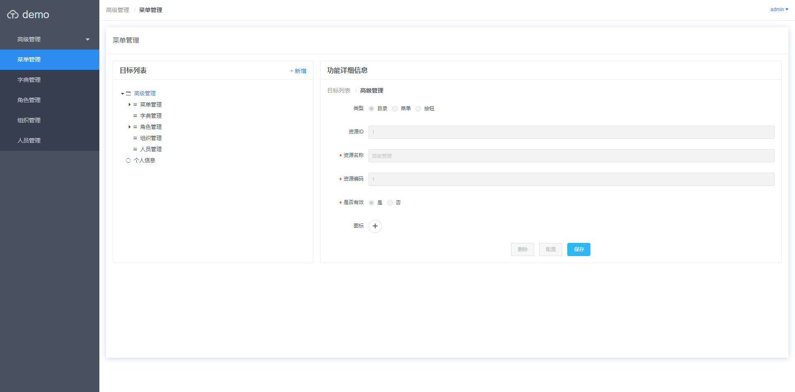

1.安全配置 默认登录账号密码为admin

2.资源中心安全配置 默认登录账号密码为管理员协同账号密码（测试环境密码默认11111）

## 添加动态页面

### 新增目录


### 新增菜单

1. 打开后台swagger-ui界面，复制对应json-schema
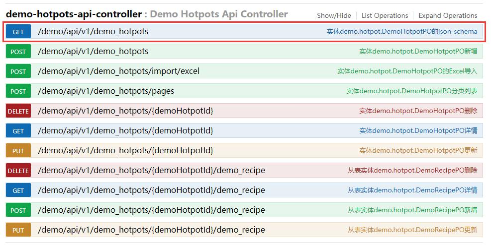

2. 填写基本信息，动态表单配置中填入json-schema地址（不需要应用名称）

    **资源名称:** 显示名称

    **资源编码:** 唯一编码，用于权限控制

    **菜单URL:** 访问地址

    **显示方法:** 
     ***div*** 对应src/views/content下vue文件
        - common/restShow.vue 动态列表配置
        - common/treeShow.vue 树形结构配置
        - common/expertTable.vue 高级关联页面配置
            - ***动态表单配置*** 填写json-schema地址

        - common/framework.vue [模板页面配置](#frameworkConfig)

    ***iframe*** 内嵌iframe页面，src填写内嵌页面路径(http://xxxxx.com)

    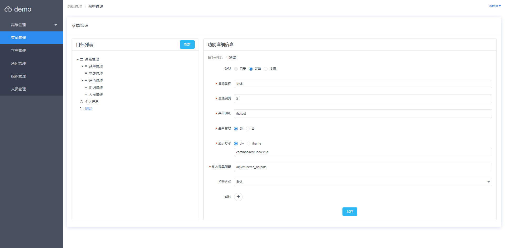

3. 保存之后，进入配置页面进行配置

    **配置列表保存**

    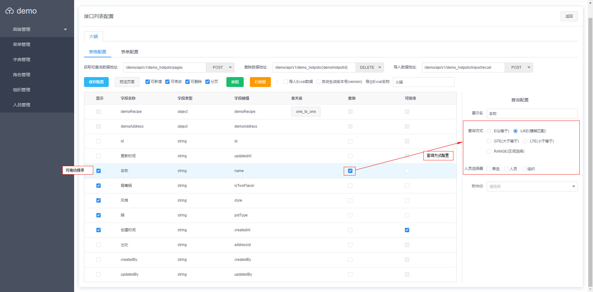

    ***one to one*** 一对一关系表配置 
 
    ***one to many*** 一对多关系配置

    **配置表单保存,可只保存表单页面为单表单页面**

    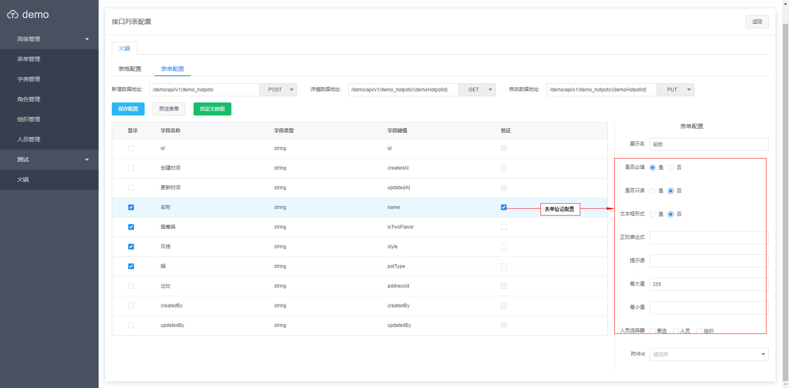

4. 配置完成之后，刷新页面
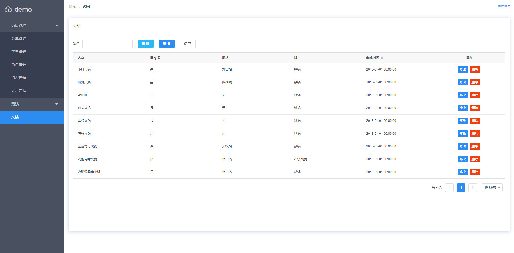 


### 自定义按钮

1. 在文件路径src/views/content/下添加自定义vue

```vue
<template>
    <Button type="success" @click="handleClick">自定义按钮</Button>
</template>
<script>
    export default {
        created() {
        },
        data() {
            return{
            }
        },
        methods:{
            handleClick(){
                this.$Message.info(JSON.stringify(this.parentData)); //获取当前页面数据
                this.$emit('refreshTable'); //刷新表格
            }
        }
    };
</script>
```

***parentData:*** 表格当前页所有数据

***refreshTable:*** 触发父组件刷新表格数据, 通过this.$emit('refreshTable')调用;

2. 菜单配置在对应菜单中添加自定义按钮
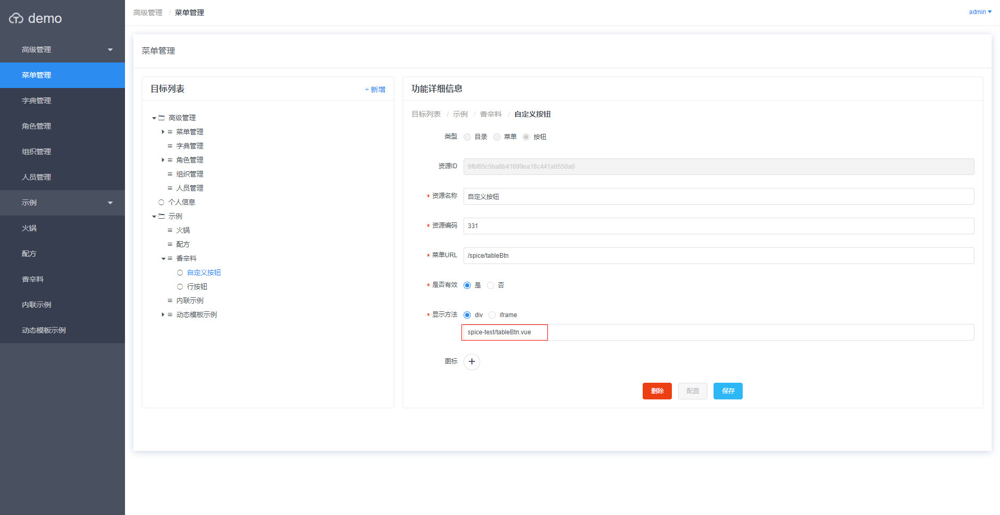

3. 表格配置点击按钮后新增（可以通过预览查看是否添加成功），保存配置
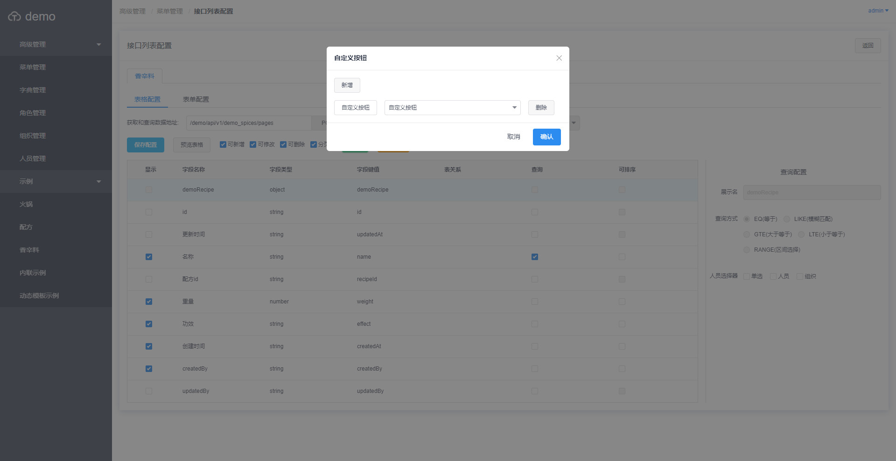


### <span id='frameworkConfig'>模板页面配置</span>

1. 在菜单管理中新增菜单
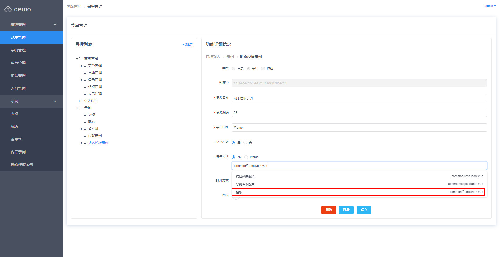

2. 添加嵌套的子页面
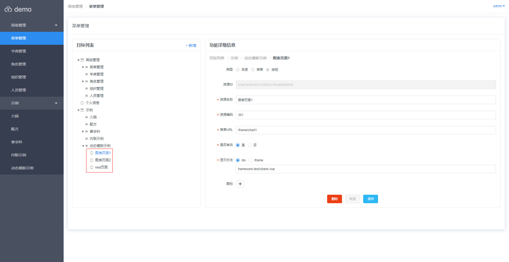

3. 选择添加的菜单配置模板
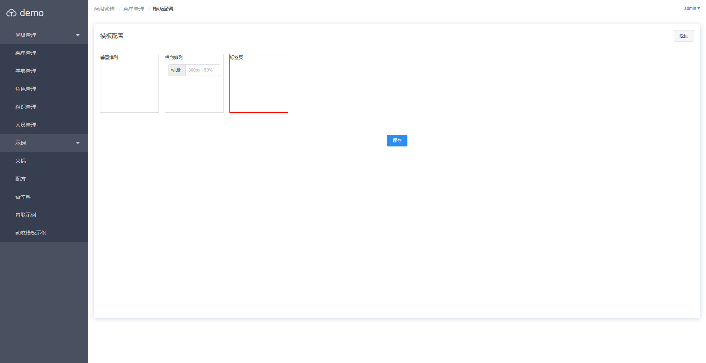


  
