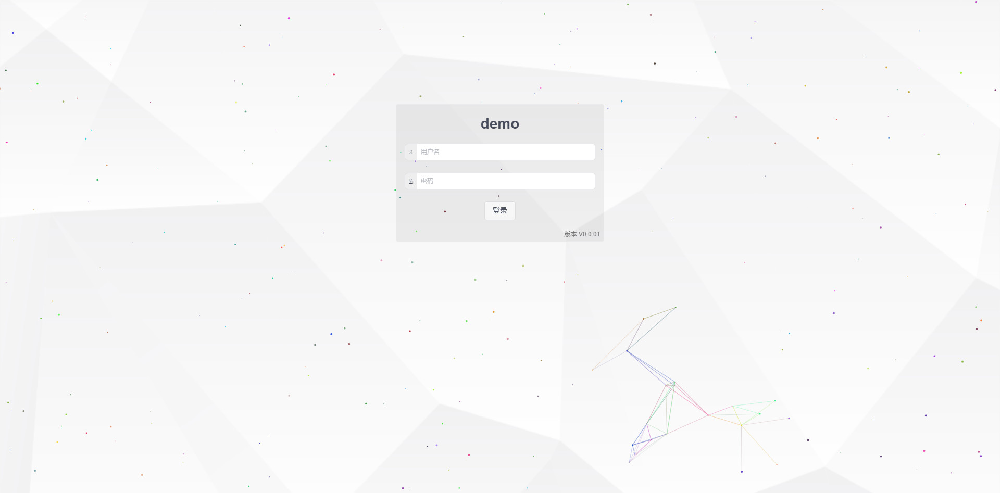

# 前端说明 v.0.0.1

## 如何运行

### 请先安装node.js，并配置好环境变量，启动后台工程

### cmd进入工程目录 执行npm install

### 安装完成后执行 npm run dev

### 运行结果


## 菜单管理

### 添加目录、菜单、按钮

**资源名称:** 显示名称

**资源编码:** 唯一编码，用于权限控制

**菜单URL:** 访问地址

**显示方法:** 
1. ***div*** 对应src/views/content下vue文件
    - common/restShow.vue restful [页面配置](#restConfig)
    - common/expertTable.vue 高级关联页面配置
        - ***动态表单配置*** 填写json-schema地址

    - common/framework.vue [模板页面配置](#frameworkConfig)

2. ***iframe*** 内嵌iframe页面，src填写内嵌页面路径(http://xxxxx.com)

<font color=#f34b1e>注意：新增目录、菜单、按钮任意一项都需要在角色配置添加对应访问权限（包含管理员）</font>


## <span id="restConfig">接口列表配置</span>

### 表格配置
<font color=#f34b1e>注意：保存子表配置之前，先保存主表配置 </font>


1. ***one to one*** 一对一关系表配置 

2. ***one to many*** 一对多关系配置


### 表单配置
<font color=#f34b1e>注意：单表单页面配置请不要保存**表格配置** </font>


### 自定义按钮

1. 在文件路径src/views/content/下添加自定义vue

```vue
<template>
    <Button type="success" @click="handleClick">自定义按钮</Button>
</template>
<script>
    export default {
        created() {
        },
        data() {
            return{
            }
        },
        methods:{
            handleClick(){
                this.$Message.info(JSON.stringify(this.parentData)); //获取当前页面数据
                this.$emit('refreshTable'); //刷新表格
            }
        }
    };
</script>
```

***parentData:*** 表格当前页所有数据

***refreshTable:*** 触发父组件刷新表格数据, 通过this.$emit('refreshTable')调用;

2. 菜单配置在对应菜单中添加自定义按钮


2. 在角色管理中添加访问权限
<font color=#f34b1e>注意：新增目录、菜单、按钮任意一项都需要在角色配置添加对应访问权限（包含管理员）</font>


3. 表格配置点击按钮后新增（可以通过预览查看是否添加成功），保存配置


### <span id='frameworkConfig'>模板页面配置</span>

<font color=#f34b1e>注意：新增目录、菜单、按钮任意一项都需要在角色配置添加对应访问权限（包含管理员）</font>

1. 在菜单管理中新增菜单


2. 添加嵌套的子页面


3. 选择添加的菜单配置模板


  
